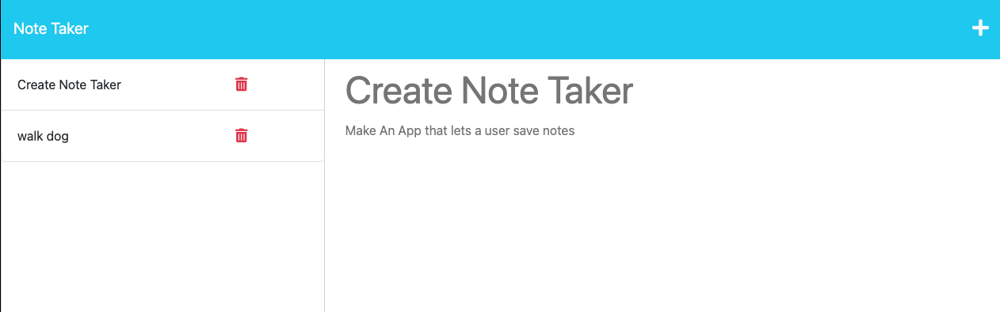

# Note Taker Application

## Description

This application allows the user to take notes online and save then on a server

## User Story

As A small business owner, I want to be able to write and save notes, So I can organize my thoughts and keep track of tasks I need to complete

## Acceptance Criteria

Given a note-taking application:

- When I open the Note Taker, Then I am presented with a landing page with a link to a notes page

- When I click on the link to the notes page, Then I am presented with a page with existing notes listed in the left-hand
  column, plus empty fields to enter a new note title and the note’s text in the right-hand column

- When I enter a new note title and the note’s text, Then a Save icon appears in the navigation at the top of the page

- When I click on the Save icon, Then the new note I have entered is saved and appears in the left-hand column with the other existing notes

- When I click on an existing note in the list in the left-hand column, Then that note appears in the right-hand column

- When I click on the Write icon in the navigation at the top of the page, Then I am presented with empty fields to enter a new note title and the note’s text in the right-hand column

## Mock-Up

The following animation demonstrates the application functionality:

## Live Demo

A Live Demo Can be Found [Here](https://julianmlacey.github.io/NoteTaker/](https://blooming-garden-60738-00b868f1d491.herokuapp.com/)

https://github.com/JulianmLacey/NoteTaker/assets/117090683/47ed54fc-a8a7-4b1e-a7fb-a9b2bbfa25b3

## License

View "LICENSE" in Repository
